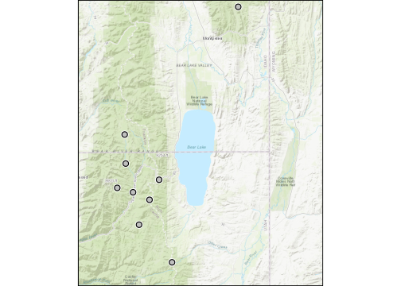

<!-- README.md is generated from README.qmd. Please edit that file -->

# awdb

<!-- badges: start -->

[](https://github.com/kbvernon/awdb/actions/workflows/R-CMD-check.yaml)
<!-- badges: end -->

The `{awdb}` package provides tools for querying the USDA National Water
and Climate Center [Air and Water Database REST
API](https://wcc.sc.egov.usda.gov/awdbRestApi/swagger-ui/index.html).
The package is extremely light weight, with Rust via
[`extendr`](https://extendr.github.io/) doing most of the heavy lifting
to deserialize and flatten deeply nested JSON responses. The package is
also designed to support pretty printing of `tibbles` if you import the
`{tibble}` package.

## Installation

You can install the development version of `{awdb}` from
[GitHub](https://github.com/) with:

``` r
# install.packages("pak")
pak::pak("kbvernon/awdb")
```

## The AWDB REST API

This package provides a separate function to query each endpoint at the
USDA AWDB REST API:

| Endpoint       | Function           |
|:---------------|:-------------------|
| data           | `get_elements()`   |
| forecasts      | `get_forecasts()`  |
| reference-data | `get_references()` |
| metadata       | `get_stations()`   |

Because the API does not provide for spatial queries, requests made with
areas of interest (`aoi`) first ask the API metadata endpoint for all
stations in the database and their spatial coordinates. It converts the
set to an `sf` object, performs a spatial filter with the `aoi`, and
then sends another request for `elements` or `forecasts` at the stations
in the `aoi`.

## Get Stations

Find all AWDB stations around Bear Lake in northern Utah that measure
soil moisture percent at various depths.

``` r
library(awdb)
library(sf)
library(tibble)

stations <- get_stations(bear_lake, elements = "SMS:*")

stations
#> Simple feature collection with 9 features and 14 fields
#> Geometry type: POINT
#> Dimension:     XY
#> Bounding box:  xmin: -111.6296 ymin: 41.68541 xmax: -111.1663 ymax: 42.4132
#> Geodetic CRS:  WGS 84
#> # A tibble: 9 × 15
#>   station_triplet station_id state_code network_code name   dco_code county_name
#>   <chr>           <chr>      <chr>      <chr>        <chr>  <chr>    <chr>      
#> 1 374:UT:SNTL     374        UT         SNTL         Bug L… UT       Rich       
#> 2 484:ID:SNTL     484        ID         SNTL         Frank… UT       Franklin   
#> 3 1114:UT:SNTL    1114       UT         SNTL         Garde… UT       Cache      
#> 4 493:ID:SNTL     493        ID         SNTL         Giveo… ID       Bear Lake  
#> 5 1115:UT:SNTL    1115       UT         SNTL         Klond… UT       Cache      
#> 6 1013:UT:SNTL    1013       UT         SNTL         Templ… UT       Cache      
#> 7 823:UT:SNTL     823        UT         SNTL         Tony … UT       Cache      
#> 8 1113:UT:SNTL    1113       UT         SNTL         Tony … UT       Cache      
#> 9 1098:UT:SNTL    1098       UT         SNTL         Usu D… UT       Rich       
#> # ℹ 8 more variables: huc <chr>, elevation <dbl>, data_time_zone <dbl>,
#> #   pedon_code <chr>, shef_id <chr>, begin_date <chr>, end_date <chr>,
#> #   geometry <POINT [°]>
```

<div style="width: 65%; margin: 0 auto;">



</div>

## Get Elements

USDA NWCC refers to soil, snow, stream, and weather variables measured
at AWDB stations as “elements.” Here we get snow water equivalent and
soil moisture measurements around Bear Lake in early May of 2015.

``` r
elements <- get_elements(
  bear_lake,
  elements = c("WTEQ", "SMS:8"),
  awdb_options = set_options(
    begin_date = "2015-05-01",
    end_date = "2015-05-07"
  )
)

elements[, c("station_triplet", "element_code", "element_values")]
#> # A tibble: 10 × 3
#>    station_triplet element_code element_values
#>    <chr>           <chr>        <list>        
#>  1 374:UT:SNTL     WTEQ         <df [7 × 2]>  
#>  2 471:ID:SNTL     WTEQ         <df [7 × 2]>  
#>  3 484:ID:SNTL     WTEQ         <df [7 × 2]>  
#>  4 1114:UT:SNTL    WTEQ         <df [7 × 2]>  
#>  5 493:ID:SNTL     WTEQ         <df [7 × 2]>  
#>  6 1115:UT:SNTL    WTEQ         <df [7 × 2]>  
#>  7 1013:UT:SNTL    WTEQ         <df [7 × 2]>  
#>  8 823:UT:SNTL     WTEQ         <df [7 × 2]>  
#>  9 1113:UT:SNTL    WTEQ         <df [7 × 2]>  
#> 10 1098:UT:SNTL    WTEQ         <df [7 × 2]>

elements[["element_values"]][[1]]
#>         date value
#> 1 2015-05-01   2.1
#> 2 2015-05-02   1.1
#> 3 2015-05-03   0.0
#> 4 2015-05-04   0.0
#> 5 2015-05-05   0.0
#> 6 2015-05-06   0.0
#> 7 2015-05-07   0.0
```

These are time series, so the element values come in a list column
containing data.frames with at least `date` and `value` columns. Using
`tidyr::unnest()` is helpful for unpacking all of them.

## Get Forecasts

TODO!

## Get References

A somewhat unique endpoint for this REST API is called “References.” If
you have ever worked with government employees or the military, you
maybe are aware that they prefer an extremely condensed form of speech
jammed full of acronyms and other codes. The references endpoint helps
clarify their cryptic language with data dictionaries that explain what
each code used in the database actually means. It also in the process
provides an exhaustive list of available options. All of this, you can
access with `get_references()`. For instance, if you want a table
showing all possible station elements in the AWDB, it is as simple as
this.

``` r
get_references("elements")
#> # A tibble: 115 × 9
#>    code  name     physical_element_name function_code data_precision description
#>    <chr> <chr>    <chr>                 <chr>                  <int> <chr>      
#>  1 TAVG  AIR TEM… air temperature       V                          1 Average Ai…
#>  2 TMAX  AIR TEM… air temperature       X                          1 Maximum Ai…
#>  3 TMIN  AIR TEM… air temperature       N                          1 Minimum Ai…
#>  4 TOBS  AIR TEM… air temperature       C                          1 Instantane…
#>  5 PRES  BAROMET… barometric pressure   C                          2 Barometric…
#>  6 BATT  BATTERY  battery               C                          2 Battery Vo…
#>  7 BATV  BATTERY… battery               V                          2 <NA>       
#>  8 BATX  BATTERY… battery               X                          2 Maximum Ba…
#>  9 BATN  BATTERY… battery               N                          2 Minimum Ba…
#> 10 ETIB  BATTERY… battery-eti precip g… C                          2 <NA>       
#> # ℹ 105 more rows
#> # ℹ 3 more variables: stored_unit_code <chr>, english_unit_code <chr>,
#> #   metric_unit_code <chr>
```

## Additional Query Parameters

In the above examples, we use `set_options()` to pass additional query
parameters. If you don’t pass any arguments, it uses defaults assumed by
the AWDB REST API. Some additional package specific options are also
included. It has a decent print method if you want to inspect it. It is
important to note that options are passed as part of queries to specific
endpoints.

``` r
set_options()
#> 
#> ── AWDB Query Parameter Set ────────────────────────────────────────────────────
#> Options passed to each endpoint.
#> 
#>                           VALUE STATION ELEMENT FORECAST
#> networks                      *      ✓       ✓        ✓
#> duration                  DAILY      x       ✓        x
#> begin_date                 NULL      x       ✓        x
#> end_date                   NULL      x       ✓        x
#> period_reference            END      x       ✓        x
#> central_tendency           NULL      x       ✓        x
#> return_flags              FALSE      x       ✓        x
#> return_original_values    FALSE      x       ✓        x
#> return_suspect_values     FALSE      x       ✓        x
#> begin_publication_date     NULL      x       x        ✓
#> end_publication_date       NULL      x       x        ✓
#> exceedence_probabilities   NULL      x       x        ✓
#> forecast_periods           NULL      x       x        ✓
#> station_names              NULL      ✓       ✓        ✓
#> dco_codes                  NULL      ✓       ✓        ✓
#> county_names               NULL      ✓       ✓        ✓
#> hucs                       NULL      ✓       ✓        ✓
#> return_forecast_metadata  FALSE      ✓       x        x
#> return_reservoir_metadata FALSE      ✓       x        x
#> return_element_metadata   FALSE      ✓       x        x
#> active_only                TRUE      ✓       ✓        ✓
#> request_size                 10      x       ✓        ✓
```
